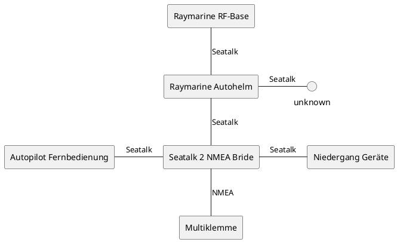
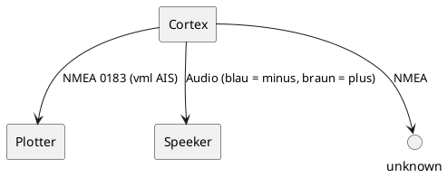

# knidos-notices
## Festlegungen
- NMEA = NMEA 2000, NMEA 0183 wird immer explizit genannt

## Legende Kabelbinder
- gelb: GPS-Cortex
    - GPS-Antenne
    - Power
    - Sensors NMEA 0183
    - VHF
- blau: Raymarine
    - RF-Base
    - Niedergang Geräte
    - Autopilot

## Legende
- RF-Base: Station für Fernbedingung Autopilot
- Backbone: Ein Backbone ist eine Hauptleitung. Der Backbone ist das sozusagen das Rückgrat (englisch Backbone) eines Netzwerks. Lokale Leitungen verbinden sich mit diesen zentralen Leitungen und speisen ihre Daten ein.
- Spurkabel: Verbindet Seatalk_ng Geräte mit Backbone

## Smart Pilot
- Steuerung des Autopiloten
- Belegte Slots sind
    - [in] Fluxgate: compass inputs
    - [in] Ruder: possition sensors
    - [in/out] Seatalk 1: seatalk 2 seatalk_ng + x?!
    - [in/out] Seatalk 2: unknown
    - [in/out] PWR
    - [out] Antriebsmotor
    - [out] Antriebskupplung
- sealtalk 2 seatalk_ng
    - gelb: Seatalk 1, siehe [in/out] Seatalk 1
    - blau: Backbone Plotter oder Autopilot?
    - weiß: Spurkabel Strom?

## GPS - System
- NMEA 0183, Orange und Schwarz werden nach hinten in einem grauen Kabel zum Plotter gerootet.
    - mappinng: orange|weiß, schwarz|grün
- Audio Außenlautsprecher rot = plus, scharz = minus
    - Kabel zum Lautsprecher blau = minus und braun = plus [ACHTUNG!]

## Navtex
- Multiklemme liefert Daten für Navtex Receiver

## Things
- 3 pending GPS-Kabel eines nach hinten, eines der Pilz vorne?
- Cortex: NMEA an Seatalk Bridge NMEA OUT legen -> Alle Daten vom Schiff auf Funkgerät?
- Woher kommen welche Sensordaten und wohin fließen sie? -> Siehe Datenflussdiagramm WIP
- Überlegung neuer Plotter: NMEA einfach an Smart Pilot NMEA OUT klemmen
- Neuer Plotter Sealtalk_ng to NMEA Kabel an seatalk 2 sealtak_ng

## Datenflüsse

### Datenfluss Raymarine

### Cortex

