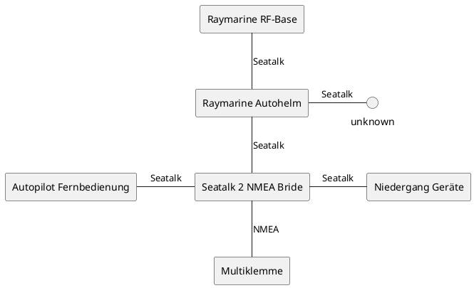
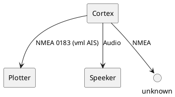

# knidos-notices
## Festlegungen
- NMEA = NMEA 2000, NMEA 0183 wird immer explizit genannt

## Legende Kabelbinder
- gelb: GPS-Cortex
    - GPS-Antenne
    - Power
    - Sensors NMEA 0183
    - VHF
- blau: Raymarine
    - RF-Base
    - Niedergang Geräte
    - Autopilot

## Smart Pilot
- Steuerung des Autopiloten
- Belegte Slots sind
    - [in] Fluxgate: compass inputs
    - [in] Ruder: possition sensors
    - [in/out] Seatalk 1: seatalk 2 seatalk_ng + x?!
    - [in/out] Seatalk 2: unknown
    - [in/out] PWR
    - [out] Antriebsmotor
    - [out] Antriebskupplung

## Legende
- RF-Base: Station für Fernbedingung Autopilot

## GPS - System
- NMEA 0183, Orange und Schwarz werden nach hinten in einem grauen Kabel zum Plotter gerootet.
    - mappinng: orange|weiß, schwarz|grün

## Navtex
- Multiklemme liefert Daten für Navtex Receiver

## Things
- Braunes Kabel ist Audio mit blau = plus und braun minus (geht nicht)
- 3 pending GPS-Kabel eines nach hinten, eines der Pilz vorne?
- NMEA zur Seatalk - NMEA Converter legen?
- Woher kommen welche Sensordaten und wohin fließen sie?

## Datenflüsse

### Datenfluss Raymarine

### Cortex

